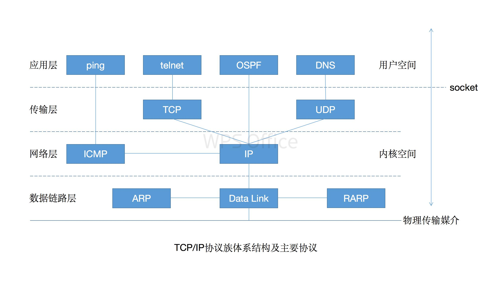
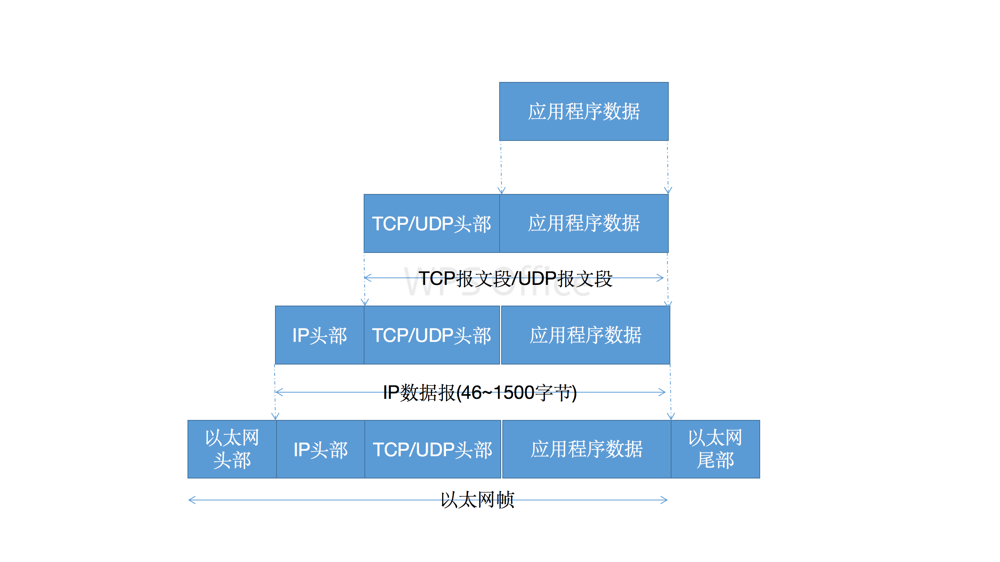

##### 封装

每层都在上层数据的基础上加上自己的头部信息(有时候还包括尾部信息)，以实现该层的功能，该过程就叫封装。

## 一、应用层

#### telnet协议
远程登录协议

#### OSPF协议(开放最短路径优先)
Open Short Path First
动态路由更新协议，用于路由器之间的通信，以告知对方各自的路由信息。

#### DNS
Domain Name Service
协议提供机器域名到IP地址的转换

## 二、传输层

### TCP协议
为应用层提供可靠的、面向连接，基于流的服务。

- 使用超时重传、数据确认等方式来确保数据包被正确的发送至目的端，因此是可靠的
- 通信的双方必须先建立连接，并且在内核中维持一些必要的数据结构，比如连接的状态、读写缓冲区，以及诸多定时器。
- 基于流的数据没有边界(长度)限制，它源源不断的从通信的一端流入到另一端

##### TCP报文
经过TCP封装后的数据称为TCP报文段。

#### UDP协议
为应用层提供不可靠、无连接和基于数据报的服务

- 不能保证数据正确的传送到目的端
- 无连接，每次发送数据都要明确指定接收端的IP地址
- 基于数据报的服务，是相对基于流的服务而言的。每个数据报都有一个长度，接收端必须以该长度为最小单位将其内容一次性读出，否则会被截断。

##### UDP数据报
经过UDP封装后的数据称为UDP数据报。

UDP封装与TCP类似，不同的是UDP无须为应用程序保存副本，因为它提供的服务是不可靠的。

#### SCTP协议
Stream Control Transmission Protocol，流控制传输协议，为了在因特网传输电话信号而设置的

## 三、网络层

#### 作用
网络层实现数据包的选路和转发。

#### 广域网(Wide Area Network)
WAN 通常使用众多分级的路由器来连接分散的主机或LAN，通信的两台主机一般不是直接相连的，而是通过多个中间节点(路由器)连接的。

#### IP协议(Internet Protocol)
IP协议根据数据包的目的IP地址来决定如何投递它。如果数据包不能直接发送给目标主机，那么IP协议就为它寻找一个合适的下一跳(next hop)路由器，并将数据包交付给该路由器进行转发。

##### IP数据报
经过IP封装后的数据称为数据报

IP协议使用逐跳(hop by hop)的方式确定通信路径。

#### ICMP协议(Internet Control Message Protocol)
因特网控制报文协议，是IP协议的重要补充，主要用于检测网络连接。

##### 8位类型
1.差错报文
这类报文主要用来回应网络错误，比如目标不可到达(类型值为3)和重定向(类型值为5)。

2.查询报文
这类报文用来查询网络信息，比如ping程序就是使用ICMP报文查看目标是否可到达(类型值为8)的。

##### 8位代码
有些报文会使用8位代码进一步细分不同的条件。
比如重定向报文使用0表示网络重定向，使用1表示主机重定向

##### 16位校验和
对整个报文进行循环冗余的校验，以检验报文在传输过程中是否损坏

## 四、数据链路层

#### 作用
数据链路层实现了网卡接口的网络驱动程序，以处理数据在物理媒介(比如以太网、令牌环等)上的传输。

##### 帧(fream)
经过数据链路层封装后的数据称为帧。帧才是最终在物理网络上传输的字节序列。传输媒介不同，帧的类型也不同。
- 以太网上传输的是以太网帧
- 令牌环网络上传输的是令牌环帧

#### ARP协议

地址解析协议(Address Resolve Protocol)

#### RARP协议

逆地址解析协议(Reverse Address Resolve Protocol)
